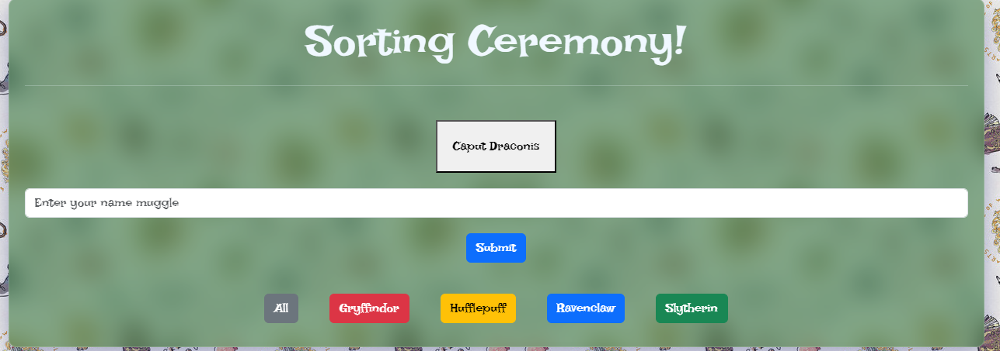
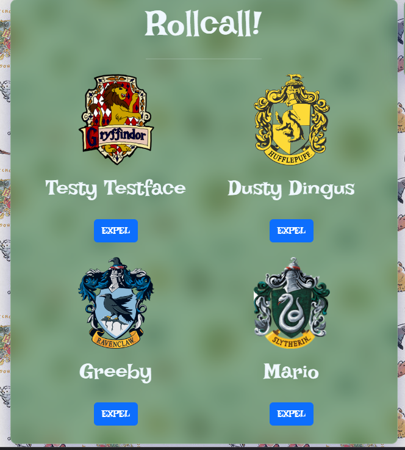
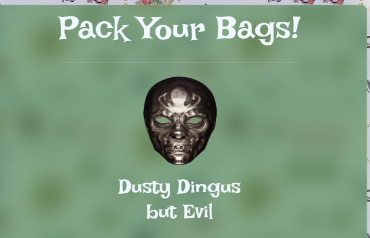

Name of the Project: Sorting Ceremony
Overview of the project: Enter the world of Harry Potter and determine your house by being sorted by the Sorting Hat. Stay in line or you run the risk of being expelled to Voldemorts dark army and sent packing. 
Link to your wireframes/prototype: https://www.figma.com/file/E3i83w8Z0sujA1LHHXIrRN/Sorting-Hat?type=whiteboard&t=uWbjiBBGiTWBQbAL-0
Link to the deployed project:
Link to your project board:
Description of the user and the problem you are solving for them:
Example 1: As a developer, it is important to understand the concepts of Array Methods, filters, bootstrap elements, refactoring, and loops.
Example 2: The user for my application is a Harry Potter fan who wants to be sorted into a house to emulate the books. 
List of features: A button that toggles a form, the ability to enter a name into the form with a randomized house feature, a filter to see who is sorted into which house, and an expel button to remove students from the rollcall.
Screenshots of your project:

Link to Loom video walkthrough of your app:
